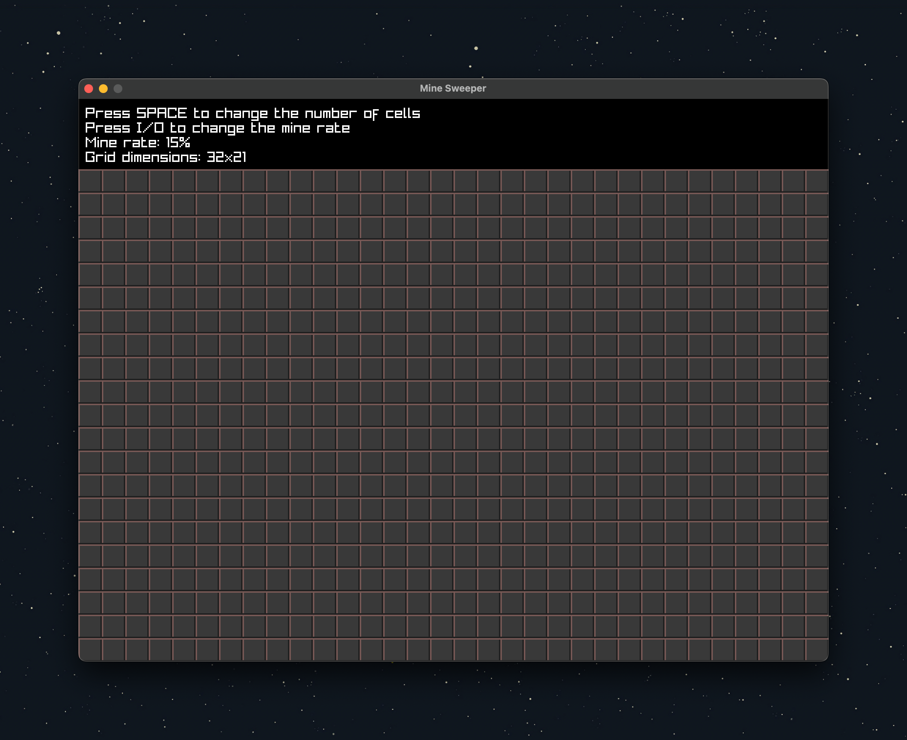
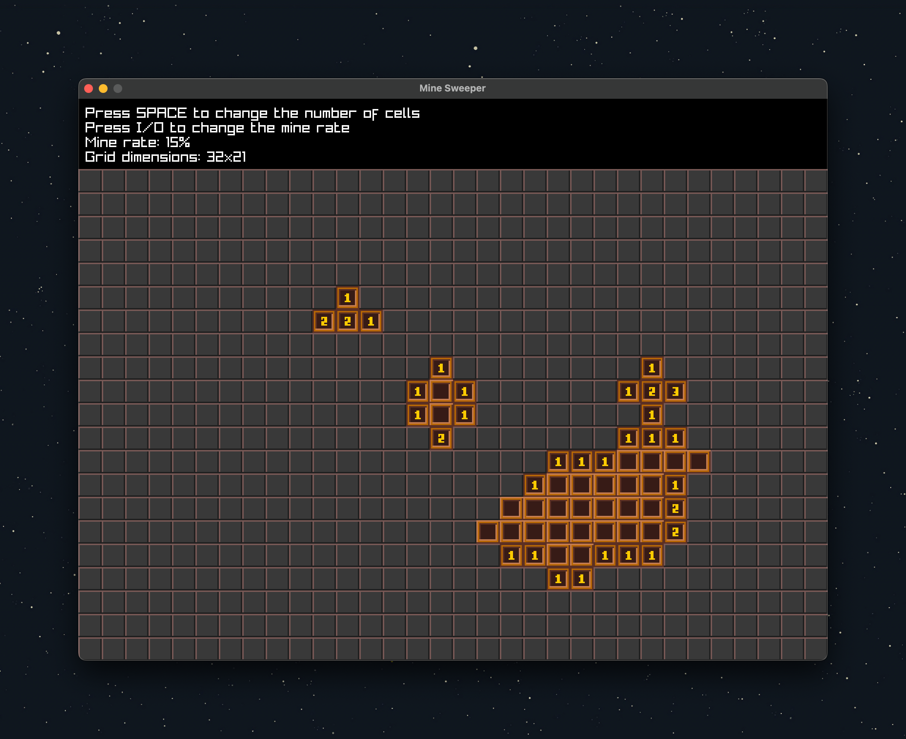
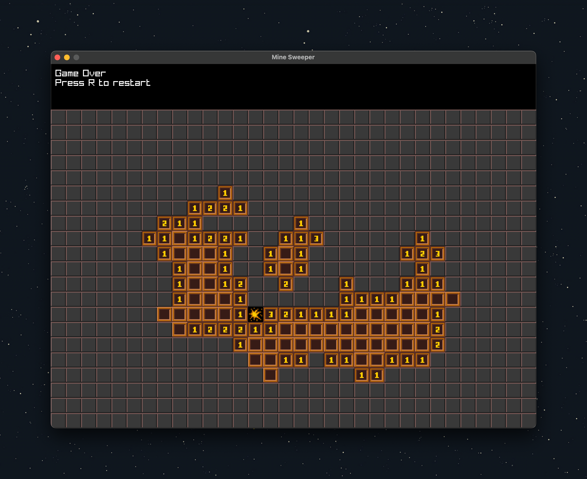

# A simple minesweeper game written in C++ using raylib library

This is a simple minesweeper game written in C++ using the raylib library. The game is a simple implementation of the classic minesweeper game. The game is written in C++ and uses the raylib library for rendering and input handling.

## Screenshots





## Building the game

To build the game first clone the repository recursively to get the raylib library as well. Then use the provided cmake to build the game. The game can be built using the following commands:

```sh
git clone --recursive https://github.com/burakssen/minesweeper.git
cd minesweeper
mkdir build
cd build
cmake ..
make
```

## Running the game

The game can be run from the build directory using the following command:

```sh
./minesweeper
```

## Playing the game

The game is a simple implementation of the classic minesweeper game. The game is played using the mouse. The left mouse button is used to reveal a tile and the right mouse button is used to flag a tile. The game is won when all the tiles that do not contain a mine are revealed and the game is lost when a mine is revealed. The game can be restarted using the `R` key.

## Credits

The game uses the following assets:

- [Tiles](https://kia.itch.io/16x16-tileset-for-minesweeper)

The game uses the following libraries:

- [raylib](https://www.raylib.com/)

The game uses the following tools:

- [cmake](https://cmake.org/)
